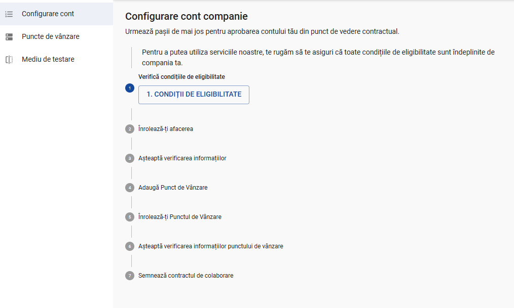
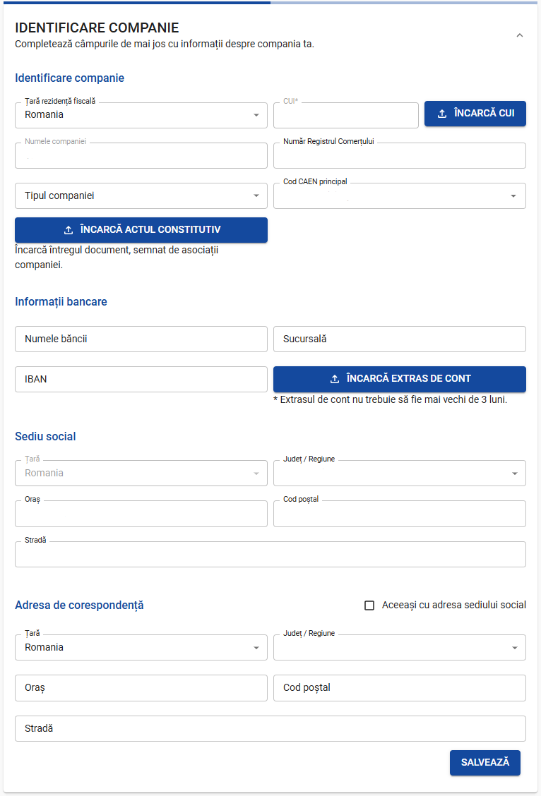

## KYC Process

#### Fill in the required information

Go to your [Netopia Admin dashboard](https://admin.netopia-payments.com) and fill in the required information

---

## Detailed instructions

Once you log into your Netopia account, you will be prompted with the required steps to complete your registration and start receiving payments

The first thing you need to do is go over our eligibility criteria and agree with them.

After clicking on the "Accepta si continua" button, the 2nd point will unlock. In this stage, you need to fill in some information about your company. Our system automatically picks up all the public information based on the Fiscal Code (CUI) that you used when registering the account, therefore some of the information will be already filled in.

After that you need to fill in the information regarding the legal representative of the company

Next is the information about the company's shareholders

The final piece of information required is about the real beneficiaries

After all the information is filled in, you can click on "Trimite datele spre validare" to send the data to Netopia for validation.