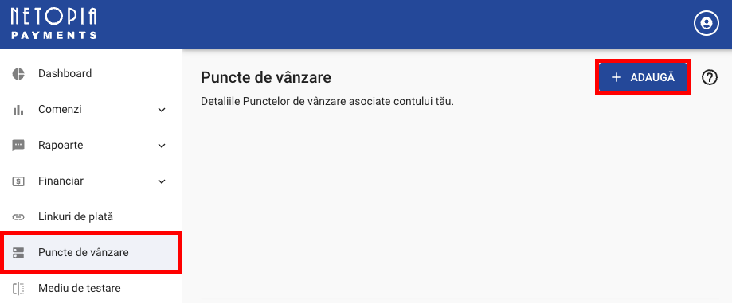
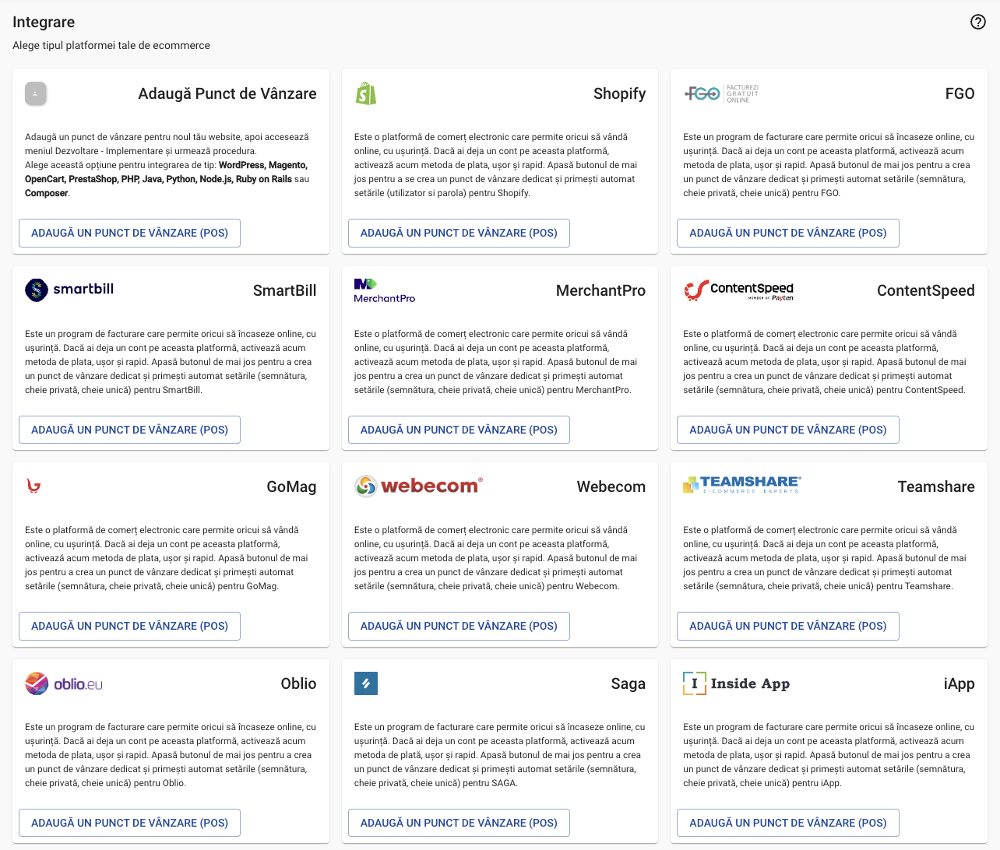
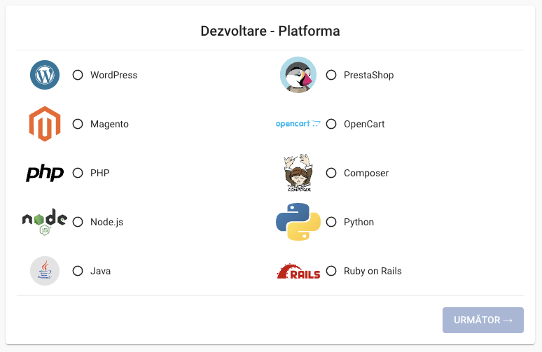
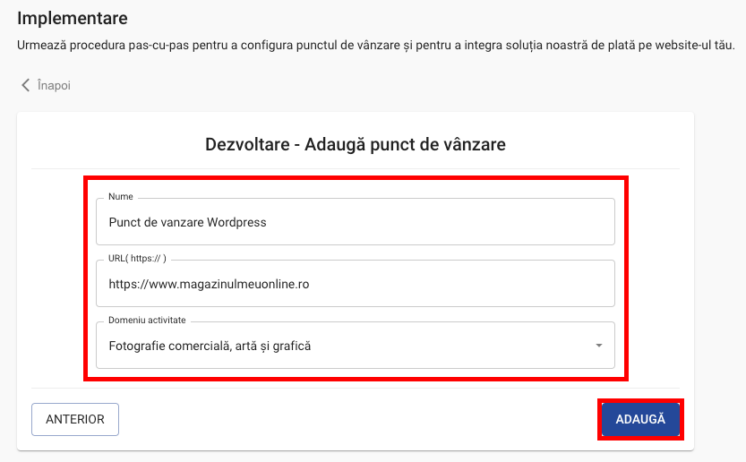
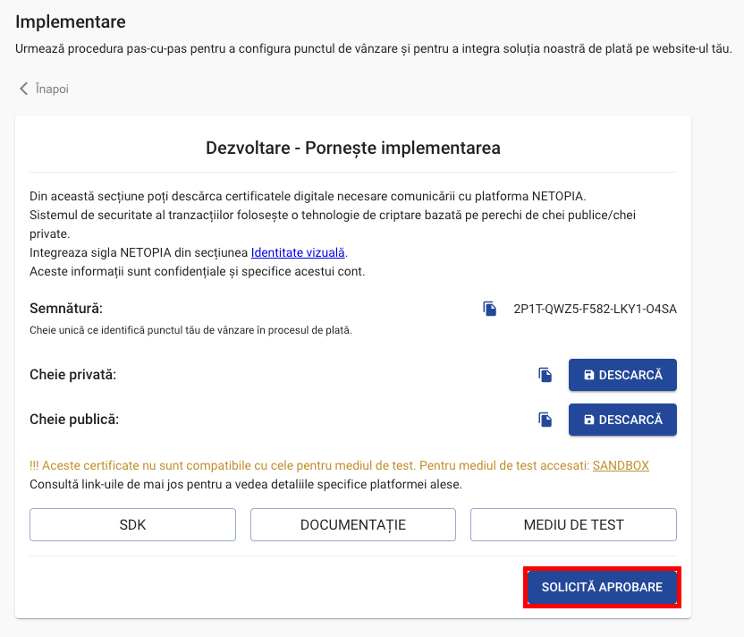
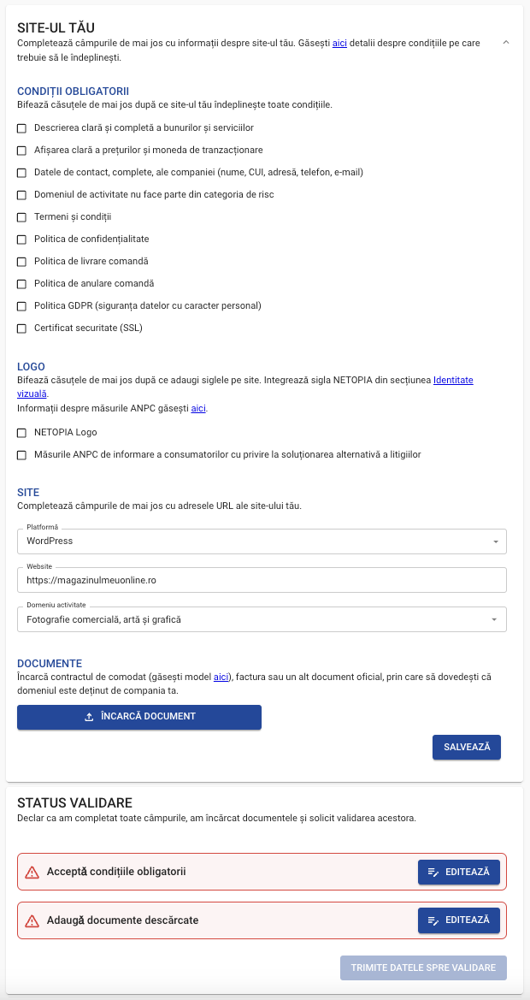

# Points of Sale

:::tip[Points of sale]

A point of sale is a web app - we support many programming languages: PHP, Java, Python, Ruby, Javascript, or an online shop - we support a wide range of ecommerce platforms: WordPress, Magento, OpenCart, PrestaShop.

:::

## Setting up a Point of Sale

#### 1. In the Netopia admin dashboard [https://admin.netopia-payments.com/](https://admin.netopia-payments.com/), go to "Puncte de vanzare" in the left menu, then click on the "ADAUGA" button from the top right

#### 2. Select your platform

You can find all the major ecommerce platforms and SDKs (PHP, Node.js, Python, etc.) under the first box "Adauga Punct de Vanzare"

Below is the complete list of integrations available:

| Vendor    |               |               |               |               |
| :---      | :---          | :---          | :---          | :---          |
| Wordpress | PrestaShop    | Magento       | OpenCart      | PHP           |
| Composer  | Node.js       | Python        | Java          | Ruby on Rails |
| Shopify   | FGO           | Smartbill     | MerchantPro   | ContentSpeed  |
| GoMag     | Webecom       | Teamshare     | Oblio         | Saga          |
| iApp      | Ovelt         | 24Broker      | Facturis      | ContApp       |
| CRM amc   | Quick Sell    | Pynbooking    | BookOnlineNow | Cartum        |
| MEFI      | BOCP Cloudbill| Link2Pay      |               |               |

#### 3. Complete the fields with the following informations:

- Name of the Point of Sale (this name will be used only for the internal reports)
- URL of the Point of Sale
- Industry of business

After filling in the fields, press the button "ADAUGA"

#### 4. The next step is to request validation for your Point of Sale, by pressing the "SOLICITA APROBARE" button.

We will return to cover the other information from this window later on.

#### 5. To validate your Point of Sale, the following points are necessary:

- You must meet the listed mandatory conditions
- Add the Netopia logos on the website
- Comply with ANPC regulations regarding consumer information on alternative dispute resolution
- Upload the loan agreement, invoice, or any other official document proving that the website domain is owned by your company

At the end, press the "TRIMITE DATELE SPRE VALIDARE" button and wait for our reply

These are the mandatory conditions required for validation:

- Clear and complete description of goods and services
- Clear display of prices and the transaction currency
- Complete contact details of the company (name, VAT number, address, phone, email)
- The business activity is not part of a high-risk category
- Terms and conditions
- Privacy policy
- Order delivery policy
- Order cancellation policy
- GDPR policy (personal data protection)
- Security certificate (SSL)

Our technical support team will help you identify and solve any technical issues that may be blocking your validation.