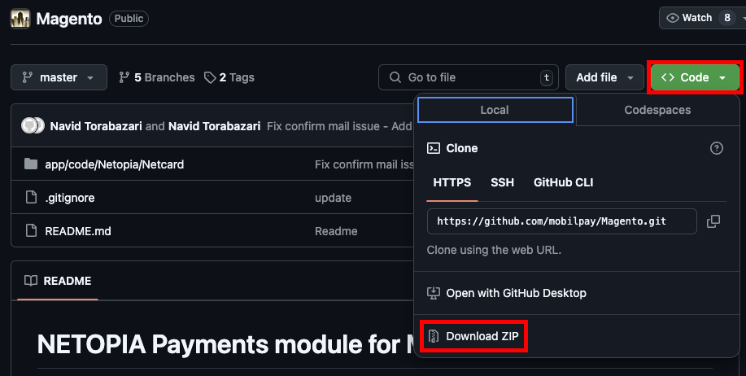
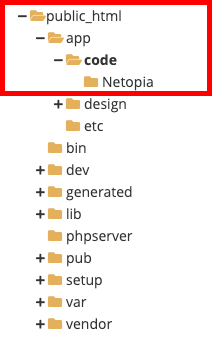
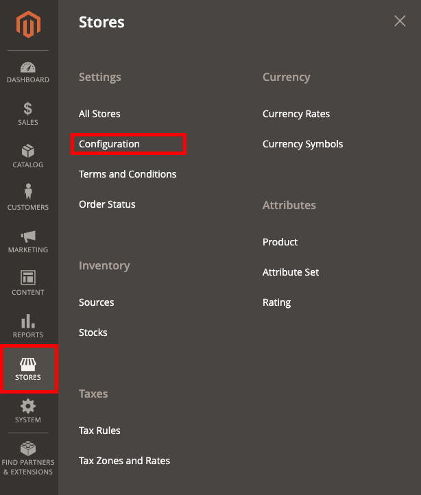
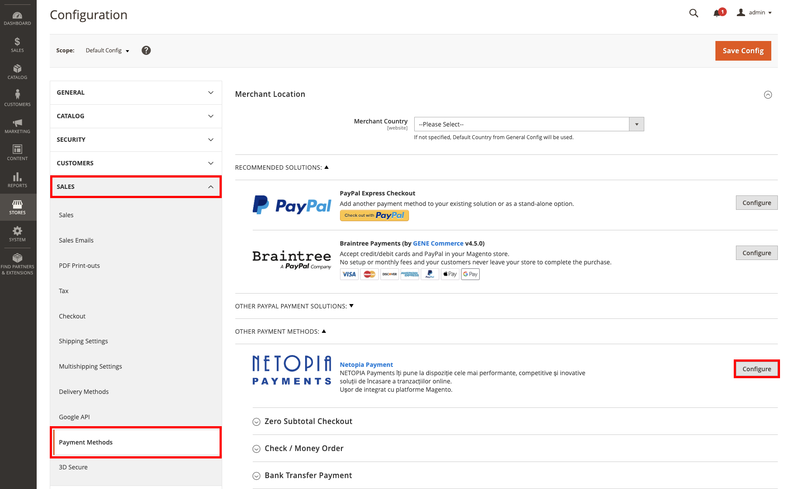
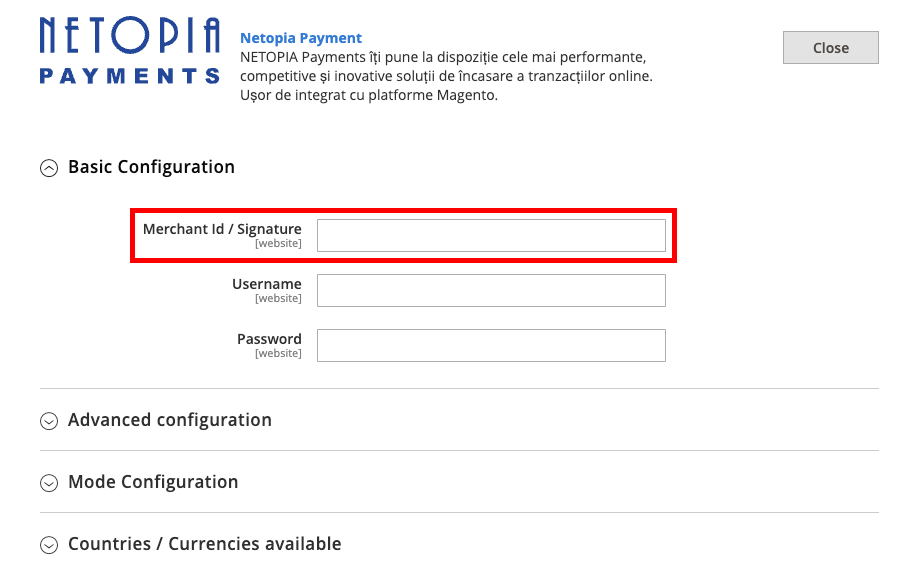
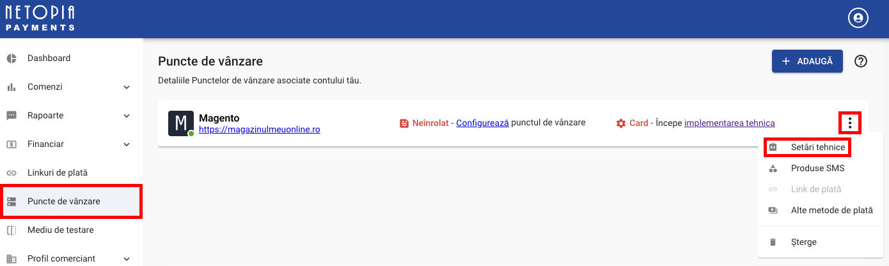
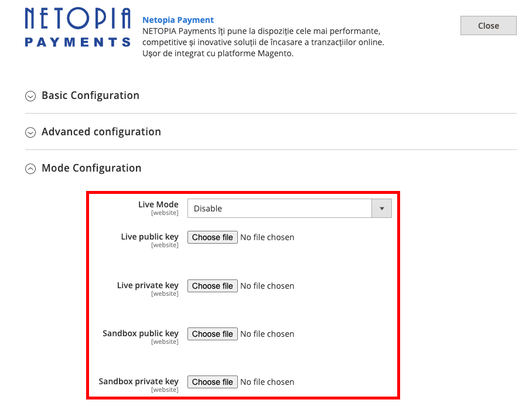

## Setting up

:::info[VERSION]

The Netopia Payments module for Magento runs on version 2.4.X

For previous versions please use the other branches on [our Github repository](https://github.com/mobilpay/Magento)

:::

### Installation

Download the Magento module from [our Github repository](https://github.com/mobilpay/Magento) by pressing on the green "Code" button in the top right and then "Download ZIP"

After unzipping the file, you will find a folder called "Netopia" in Magento-master/app/code

This folder must pe placed on your Magento server, inside of `<your_magento_root>/app/code`

Dont forget to verify the ownership and make sure you have the right user and/or group ownership

Next you need to SSH into your Magento server, go into the magento folder and run the following commands:

- `php bin/magento module:enable Netopia_Netcard`
- `php bin/magento setup:upgrade`
- `php bin/magento setup:static-content:deploy`
    * If the above command doesn't work, you can use `php bin/magento setup:static-content:deploy -f` to force it. The terminal will also instruct you to use this command
- `php bin/magento cache:flush`

:::warning[IMPORTANT]

Don't forget to enable the module using the commands above, otherwise you will not be able to see it in your Magento dashboard!

:::

### Configuration

Once you completed installing the Netopia module, you will be able to access it from your Magento dashboard by going to Stores -> Configuration (under Settings)

From here, you will find the module under SALES -> Payment Methods -> Other payment methods. You can click on "Configure" to start configuring the module.

Once you open the Netopia configuration, you will have 4 main sections: Basic configuration, Advanced configuration, Mode configuration and Countries / Currencies available.

First we need to go to "Basic configuration" and fill in the Merchant id / Signature.

The Account Signature can be found in the merchant account (https://admin.netopia-payments.com) → "Puncte de vanzare" → Options (the icon with 3 dots) → "Setari tehnice"

Next we need to go to "Mode configuration" to set up the Public and Private Keys. We can switch between Live and Sandbox mode by selecting Enable or Disable from the "Live Mode" dropdown.

The Public and Private key files can be found in the merchant account (https://admin.netopia-payments.com) → "Puncte de vanzare" → Options (the icon with 3 dots) → "Setari tehnice"

**Please note that until the final validation is received, you will be using only the SANDBOX keys**

:::warning[SANDBOX KEYS]

Make sure you click on "Mediu de testare / Testing environment" first to access the Sandbox keys! After that, simply repeat the same process from above to receive your keys.

:::

If you need access to the uploaded Private and Public key files, they are located in your Magento root folder under /app/code/Netopia/Netcard/etc/certificates

---

After this, the payment solution integration is complete!

**The last step is to send an email to implementare@netopia.ro and request the final validation. Our technical support team will activate your Point of Sale, enabling you to start receiving payments.**

---

Tested up to:

- Magento: Version **2.4.6**
- PHP: Version **8.2.8**
- Openssl: Version **3.0**

