# Opencart Plugin

:::tip[API V2]

This documentation is for Netopia Payment API V2, which uses Opencart 4.

:::

## Setting up

To set up the Opencart plugin, follow these tree steps:

#### Step 1 - Create a Point of Sale

Make sure you have already [created a Point of Sale](/docs/get-started/03-point-of-sale.md) configured specifically for Opencart. Check out the Point of Sale signature and encryption keys, which are essential for the technical implementation.

#### Step 2 - Install and activate the Netopia Payments Opencart plugin

Install the [Netopia Payments Opencart plugin](https://github.com/netopiapayments/opencart-plugin) from our Github repository and activate it.

#### Step 3 - Configure the plugin and validate the technical implementation

---

## Detailed instructions

Let's detail these steps one by one:

### Step 1 - Create a Point of Sale

You need a Point of Sale before you can configure a payment gateway. If you don't have one yet, please first follow the [Points of Sale instructions](/docs/get-started/03-point-of-sale.md) and return here once you have a validated Point of Sale.

### Step 2 - Install and activate the Netopia Payments Opencart plugin

Go to the [Netopia Github - Opencart Plugin](https://github.com/netopiapayments/opencart-plugin) and download the module by clicking on the green "Code" button in the top right and then on the "Download ZIP" button

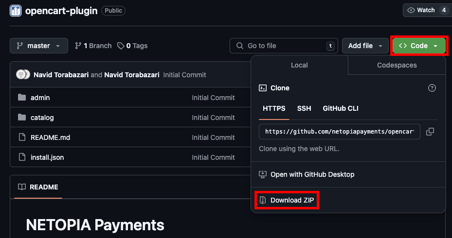

After you unzip the opencart-plugin-master.zip file, select the "install.json" file and the two folders named "admin" and "catalog" and compress the 3 files into a new .zip

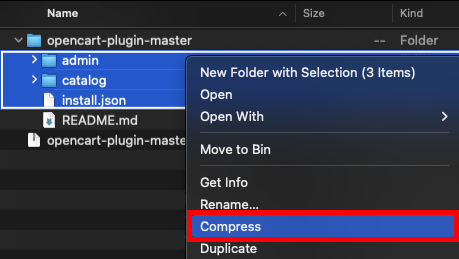

Rename the new .zip file into "mobilpay.ocmod.zip"

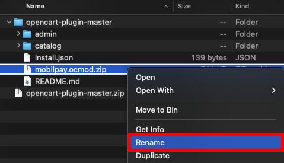

On the left menu of your Opencart dashboard, navigate to Extensions -> Installer and click on the upload file button in the top right to upload the "mobilpay.ocmod.zip" file you created in the previous step

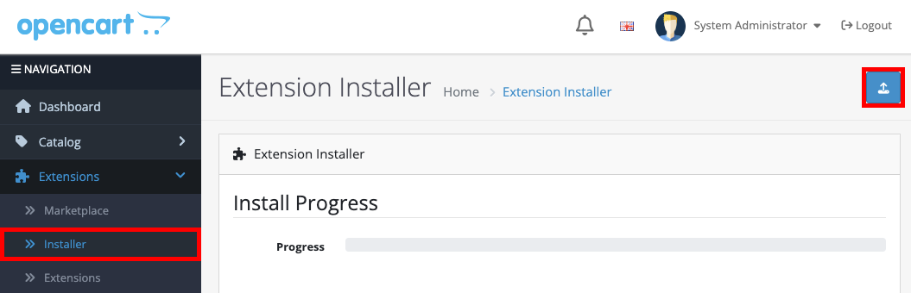

After you upload the file, you will see the NETOPIA Payments Extension under the Installed Extensions section. Click on the green install button under the Action column

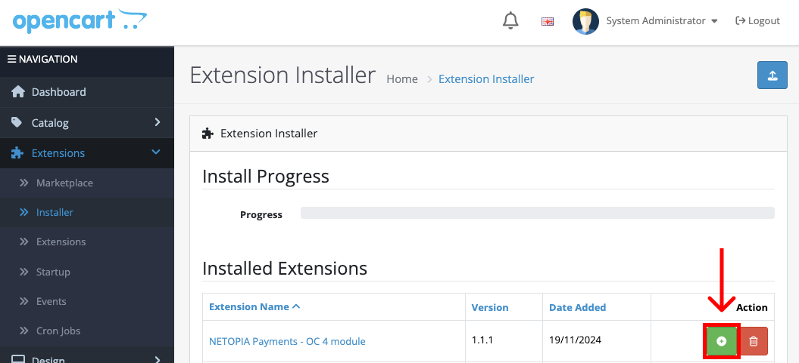

Once the extension is installed, navigate to Extensions -> Extensions in the left menu. Select the Payments category from the filter and you will see the NETOPIA Payments extension displayed in the Payments extensions list. Click on the green install button under the Action column once again for the final installation

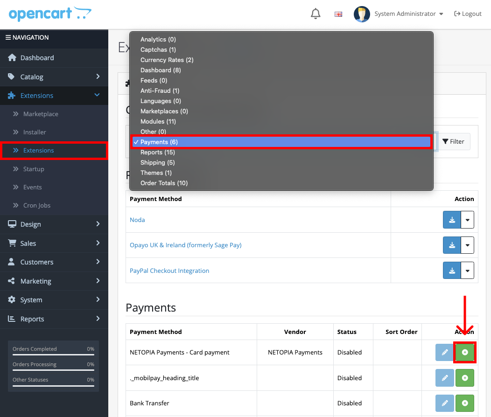

### Step 3 - Configure the plugin and validate the technical implementation

After the final installation is done, the blue configuration button will become active. Click it to configure the extension

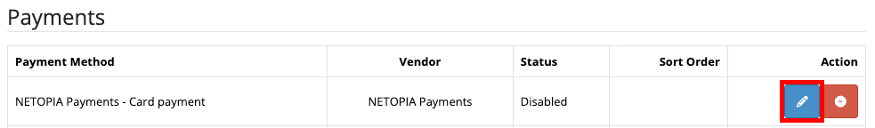

You need to provide the Account Signature, Live API Key and the Sandbox API Key

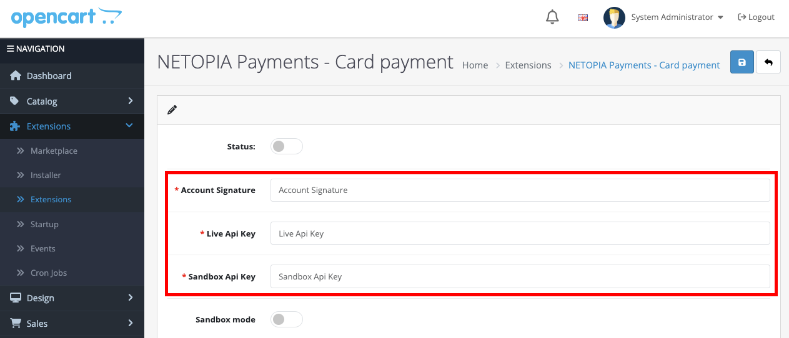

The Account Signature can be found in the merchant account (https://admin.netopia-payments.com) → Points of Sale → Options (the icon with 3 dots) → Technical Settings

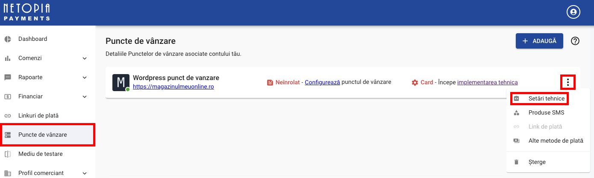

The Live API Key needs to be generated from the Netopia admin dashboard (https://admin.netopia-payments.com). You have to click on your profile image circle in the top right and then click on "Securitate"

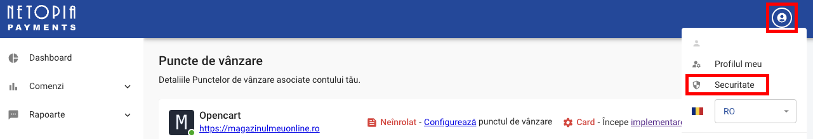

Next you have to enter a name for your key, for example "opencart", and click the "GENEREAZA CHEIE" button. You will see a new key in the list below. Simply click the Copy to clipboard icon next to the key and insert it into the Opencart Live API Key field

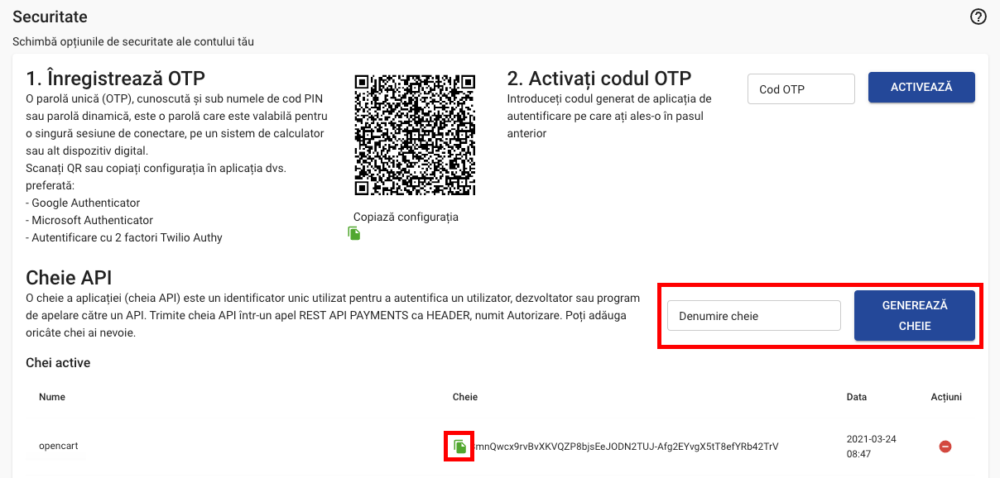

For the Sandbox API Key, you need to switch to the sandbox environment, by clicking the "Mediu de testare" button in the left menu of your Netopia admin dashboard. After that, simply repeat the same process from generating the Live API Key to generate a Sandbox API Key

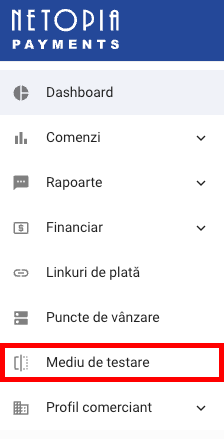

After this, the payment solution integration is complete!

**The last step is to send an email to implementare@netopia.ro and request the final validation. Our technical support team will activate your Point of Sale, enabling you to start receiving payments.**