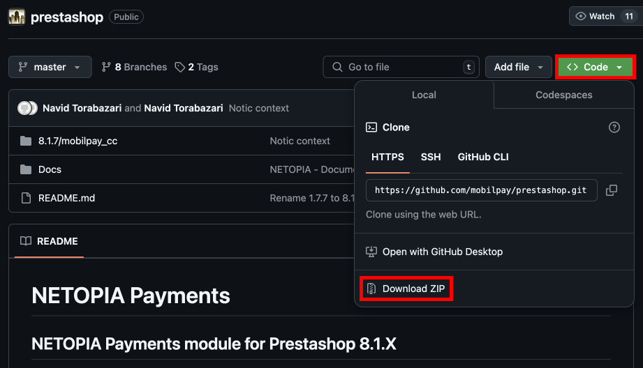
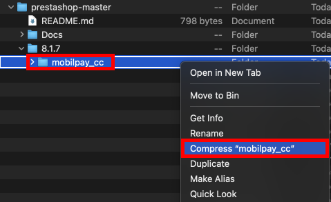
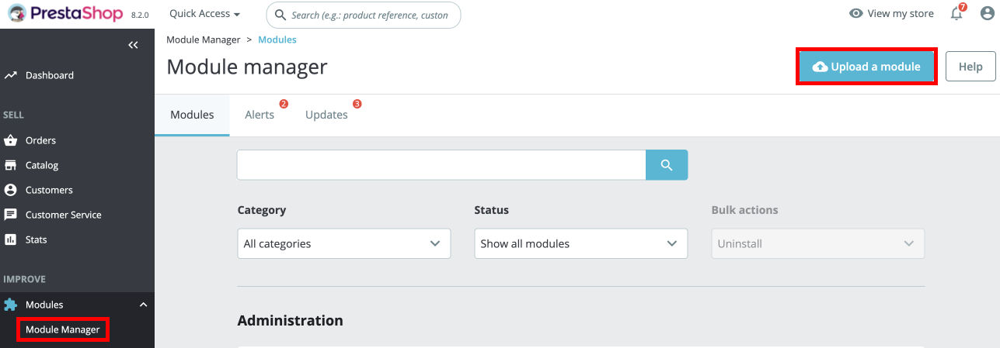
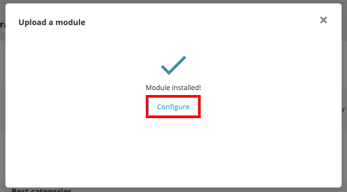
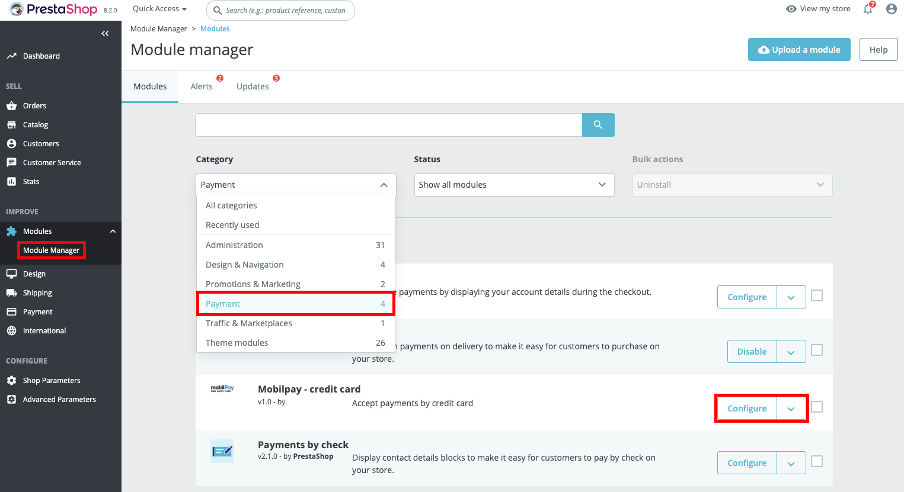
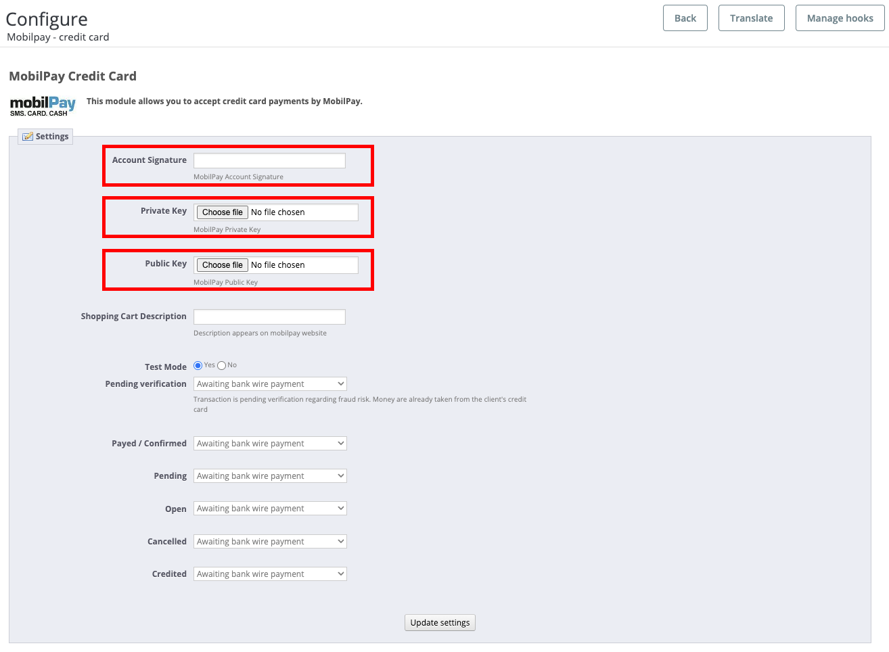
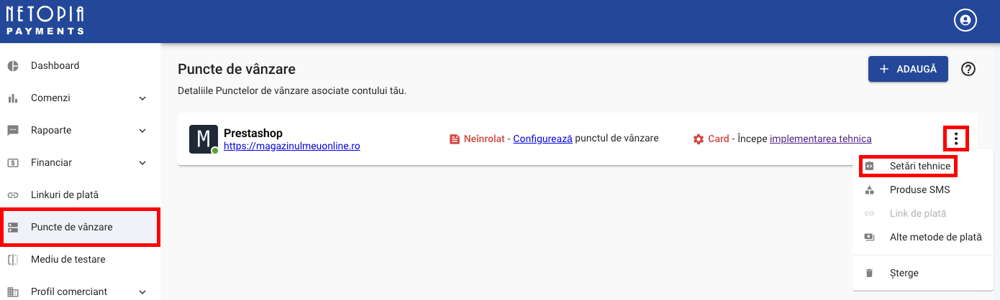

# Prestashop Plugin

## Setting up

#### 1. Go to the [Netopia Github - Prestashop module](https://github.com/mobilpay/prestashop)

#### 2. Download the module by clicking on the green "Code" button in the top right and then on the "Download ZIP" button

#### 3. Unzip the downloaded file and then navigate to the folder named as the latest Prestashop version. You have to compress the "mobilpay_cc" folder inside it into a .zip file

#### 4. In the left menu of your Prestashop dashboard, go to Modules -> Module Manager and upload the mobilpay_cc.zip that you created in the previous step

#### 5. After the module is installed, you will get a "Modules installed!" popup with a "Configure" button. Click on the button to configure the module.

Alternatively, if you wish to access the module configuration at any time, you can do so by navigating to Modules -> Module Manager from the left menu, selecting the Category "Payments" and then clicking on the "Configure" button from the Mobilpay - credit card module.

#### 6. In the module configuration, you need to provide your Account Signature and public and private key files.

#### 7. The Account Signature and the public and private key files can be found in the merchant account (https://admin.netopia-payments.com) → Points of Sale → Options (the icon with 3 dots) → Technical Settings.

NETOPIA Payments development team tries to mantain the compatibility of the Prestashop module with the latest version of Prestashop. For modules compatible with previous versions of Prestashop, please use the previous branches from our Github repository.

Tested up to Prestashop 8.1.x