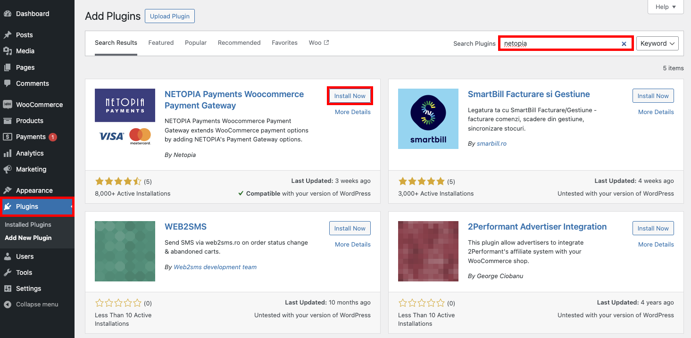

# Wordpress Plugin

To set up the wordpress plugin, follow these three steps:

#### 1. Ensure that you have already set up a point of sale configured specifically for WordPress 
Make sure you have already [created a Point of Sale](/docs/get-started/03-point-of-sale.md). Check out the Point of Sale signature and encryption keys, which are essential for the technical implementation.

#### 2. Install and activate the Netopia Payments WooCommerce Payment Gateway plugin
Install our payments plugin from Wordpress repository and activate it.

#### 3. Configure the plugin and validate the technical implementation
Configure the plugin by setting the Point of Sale signature and the associated keys. Once the integration is complete, email implementare@netopia.ro to request final validation. Our technical support team will activate your point of sale, enabling you to start receiving payments.

---
Let's detail those steps one by one:

### 1. You need a Point of Sale before you can configure a payment gateway. If you don't have one yet, please first follow the [Points of Sale](/docs/get-started/03-point-of-sale.md) instructions and return here once you have a validated Point of Sale.

#### 2. In the WordPress dashboard, go to the "Plugins" page in the left menu and search for "netopia" in the search box.
Then, click on the "Install Now" button for the NETOPIA Payments WooCommerce Payment Gateway plugin.

#### 3. After installation, don't forget to click the "Activate" button that appears in place of the "Install Now" button to activate the plugin.

#### 4. To continue setting up the payment through the Netopia Payments plugin, go to WooCommerce in the left menu, navigate to "Settings," and then to the "Payments" tab.
Here, you need to check NETOPIA Payments under the "Enabled" column and click the "Manage" button to continue configuring the plugin.

#### 5. In this step, you need to enter the Account Signature, along with the public key and private key.

The Account Signature and the public and private key files can be found in the merchant account (https://admin.netopia-payments.com) → "Puncte de vanzare" → Options (the icon with 3 dots) → "Setari tehnice"

## Wordpress.org Plugin link

[Netopia Plugin Wordpress.org link](https://wordpress.org/plugins/netopia-payments-payment-gateway/)
