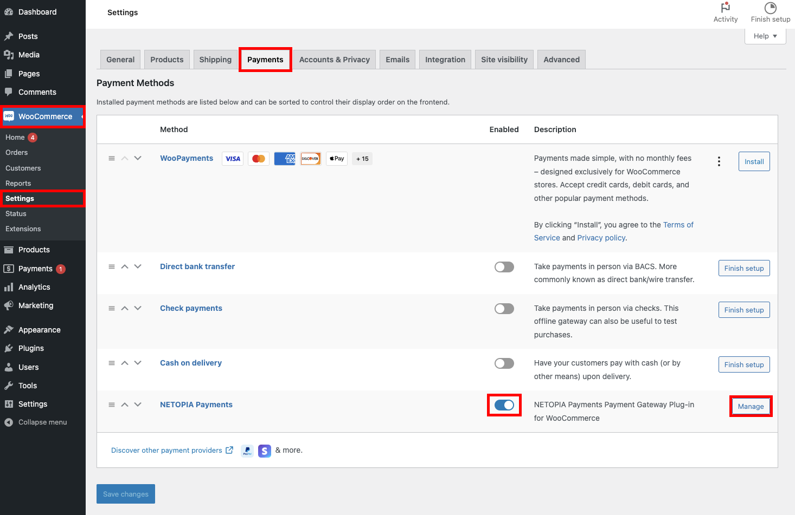
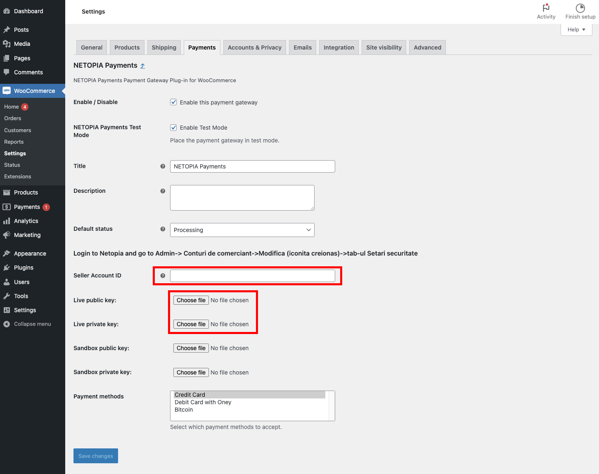
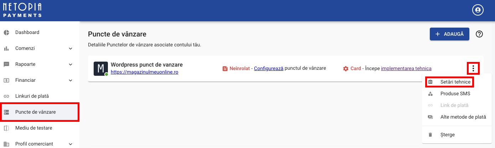

## Setting up

To set up the wordpress plugin, follow these three steps:

#### Step 1 - Create a Point of Sale

Ensure that you have already set up a Point of Sale configured specifically for WordPress 
Make sure you have already [created a Point of Sale](/docs/get-started/03-point-of-sale.md). Check out the Point of Sale signature and encryption keys, which are essential for the technical implementation.

#### Step 2 - Install and activate the Netopia Payments Wordpress plugin

Install the Netopia Payments plugin from our Wordpress repository and activate it.

#### Step 3 - Configure the plugin and validate the technical implementation

:::info

Until the final validation is received from our technical support team, you will only use the SANDBOX keys. After the validation of the technical implementation, you can also use the production keys (live keys). The SANDBOX keys are only used for testing.

:::

Configure the plugin by setting the Point of Sale signature and the associated keys.

Once the integration is complete, send an email to implementare@netopia.ro and request the final validation. Our technical support team will activate your Point of Sale, enabling you to start receiving payments.

---

## Detailed instructions

Let's detail these steps one by one:

### Step 1 - Create a Point of Sale

You need a Point of Sale before you can configure a payment gateway. If you don't have one yet, please first follow the [Points of Sale](/docs/get-started/03-point-of-sale.md) instructions and return here once you have a validated Point of Sale.

### Step 2 - Install and activate the Netopia Payments Wordpress plugin

Download NETOPIA Payments Wordpress Plugin from the following link: [netopia-payments-payment-gateway.zip](/netopia-payments-payment-gateway.zip)

In your WordPress dashboard, go to Plugins > Add New and click Upload Plugin.

Select the ZIP file you downloaded, click Install Now, and then don't forget to **click the "Activate" button** that appears in place of the "Install Now" button, once the installation is complete.

### Step 3 - Configure the plugin and validate the technical implementation

To continue setting up the payment solution through the Netopia Payments plugin, go to WooCommerce in the left menu, navigate to "Settings," and then to the "Payments" tab.
Here, you need to check NETOPIA Payments under the "Enabled" column and click the "Manage" button to continue configuring the plugin.

Here, you need to enter the Account Signature, along with the public key and private key.

---

:::warning

Make sure you click on "Mediu de testare / Testing environment" first to access the Sandbox keys!

:::

The Account Signature and the public and private key files can be found in the merchant account (https://admin.netopia-payments.com) → "Puncte de vanzare" → Options (the icon with 3 dots) → "Setari tehnice"

**Until the final validation is received, you will be using only the SANDBOX keys**

After this, the payment solution integration is complete!

**The last step is to send an email to implementare@netopia.ro and request the final validation. Our technical support team will activate your Point of Sale, enabling you to start receiving payments.**
